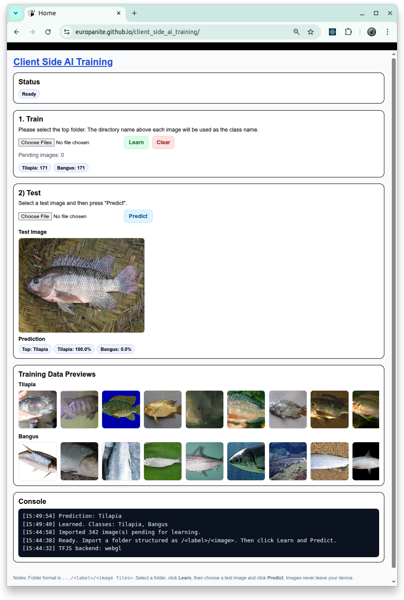

# [Client Side AI Training Light](https://github.com/europanite/client_side_ai_training_light "Client Side AI Training Light")

[](https://opensource.org/licenses/Apache-2.0)

[](https://github.com/europanite/client_side_ai_training_light/actions/workflows/ci.yml)
[](https://github.com/europanite/client_side_ai_training_light/actions/workflows/docker.yml)
[](https://github.com/europanite/client_side_ai_training_light/actions/workflows/deploy-pages.yml)




 [PlayGround](https://europanite.github.io/client_side_ai_training_light/)

A Light-Weight KNN-based AI Image Classifier Playground. 

---

##  ✨ Features

* **100% client‑side**: No server required; privacy by design.
* **Fast training**: Uses MobileNet‑V2 as a feature extractor + KNN classifier for instant incremental learning.
* **Top‑k prediction view**: Shows predicted label and per‑class confidences.

---

## 🧰 How It Works

* **Feature extractor**: [@tensorflow-models/mobilenet] provides embeddings.
* **Classifier**: [@tensorflow-models/knn-classifier] stores examples and predicts via nearest neighbors.
* **Performance**: Training scales with example count; memory is bounded by image + embedding sizes.
* **Privacy**: All computation and data stay in the tab (no network I/O of user images).

---

## Data Structure

<pre>
DATA_DIRECTORY
├── CLASS_NAME_1
│   ├── image_01.png
│   ├── image_02.png
│   ├── image_03.png
│   ├── ...
├── CLASS_NAME_2
│   ├── image_01.png
│   ├── image_02.png
│   ├── image_03.png
│   ├── ...
├── CLASS_NAME_3
│   ├── image_01.png
│   ├── image_02.png
│   ├── image_03.png
│   ├── ...
 ...
</pre>

---

## 🚀 Getting Started

### 1. Prerequisites
- [Docker Compose](https://docs.docker.com/compose/)

### 2. Build and start all services:

```bash
# set environment variables:
export REACT_NATIVE_PACKAGER_HOSTNAME=${YOUR_HOST}

# Build the image
docker compose build

# Run the container
docker compose up
```

### 3. Test:
```bash
docker compose \
-f docker-compose.test.yml up \
--build --exit-code-from \
frontend_test
```

---

# License
- Apache License 2.0